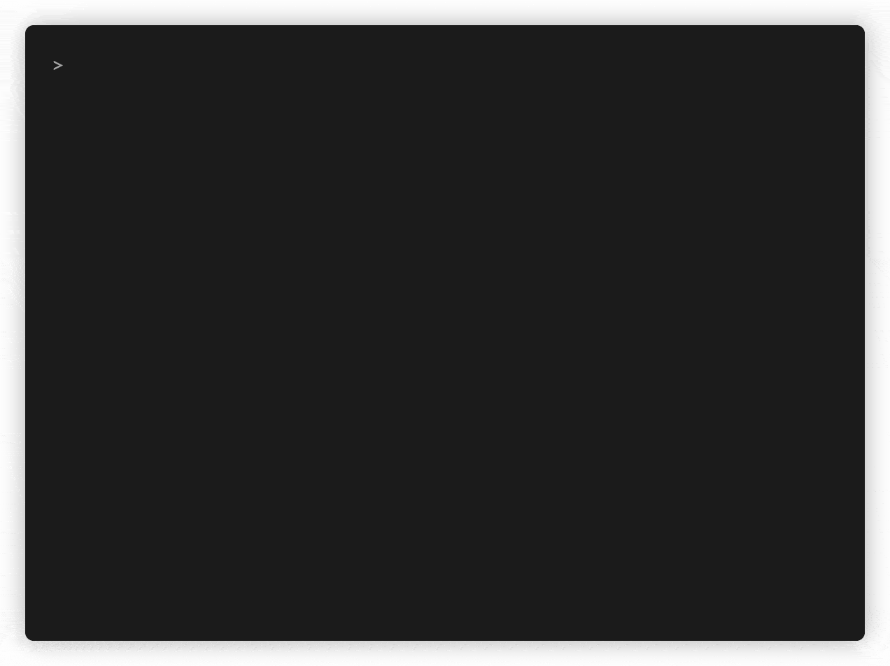

[**中文**](./README.zh.md)

# [Bibtex to Markdown Converter](https://github.com/wowchemy/bibtex-to-markdown)

  

### 📚 Easily import publications from your reference manager to your Markdown-formatted website or book

**Features**

* Import Bibtex publications (such as **books, conference proceedings and journals**) from your reference manager to your Markdown-formatted website or book
  * Simply export a BibTeX file from your reference manager, such as [Zotero](https://www.zotero.org), and provide this as the input to the converter tool
* Compatible with all static website generators such as Next, Astro, Gatsby, Hugo, etc.

**Community**

- 📚 [View the **documentation**](https://wowchemy.com/docs/content/publications/#import-from-bibtex) and usage guide below
- 💬 [Chat with the **community**](https://discord.gg/z8wNYzb)
- 🐦 Twitter: [@wowchemy](https://twitter.com/wowchemy) [@GeorgeCushen](https://twitter.com/GeorgeCushen) [#MadeWithAcademic](https://twitter.com/search?q=(%23MadeWithWowchemy%20OR%20%23MadeWithAcademic)&src=typed_query)

**❤️ Support this open-source software**

To help us develop this converter tool and the associated Wowchemy open source software sustainably under the MIT license, we ask all individuals and businesses that use it to help support its ongoing maintenance and development via sponsorship and contributing.

Support this open science movement:

  - ⭐️ [**Star** this project on GitHub](https://github.com/wowchemy/bibtex-to-markdown)
  - ❤️ [Become a **GitHub Sponsor** and **unlock perks**](https://github.com/sponsors/gcushen)
  - ☕️ [**Donate a coffee**](https://github.com/sponsors/gcushen?frequency=one-time)
  - 👩‍💻 [**Contribute**](#contribute)

## Installation

Open your **Terminal** or **Command Prompt** app and enter one of the installation commands below.

### With Pipx

For the **easiest** installation, install with [Pipx](https://pypa.github.io/pipx/): 

    pipx install academic

Pipx will **automatically install the required Python version for you** in a dedicated environment.

### With Pip

 To install using the Python's Pip tool, ensure you have [Python 3.11+](https://realpython.com/installing-python/) installed and then run:

    pip3 install -U academic

## Usage

Download references from your reference manager, such as Zotero, in the Bibtex format.

Use the `cd` command to navigate to the folder containing your Bibtex file:

    cd <MY_BIBTEX_FOLDER>

### Import publications

Say we downloaded our publications to a file named `my_publications.bib` within the website folder, let's import them into the `content/publication/` folder:

    academic import my_publications.bib content/publication/ --compact

Optional arguments:

* `--compact` Generate minimal markdown without comments or empty keys
* `--overwrite` Overwrite any existing publications in the output folder
* `--normalize` Normalize tags by converting them to lowercase and capitalizing the first letter (e.g. "sciEnCE" -> "Science")
* `--featured` Flag these publications as *featured* (to appear in your website's *Featured Publications* section)
* `--verbose` or `-v` Show verbose messages
* `--help` Help

### Import full text and cover image

After importing publications, we suggest you:
- Edit the Markdown body of each publication to add the full text directly to the page (if the publication is open access), or otherwise, to add supplementary notes for each publication
- Add an image named `featured` to each publication's folder to visually represent your publication on the page and for sharing on social media
- Add the publication PDF to each publication folder (for open access publications), to enable your website visitors to download your publication
  
[Learn more in the Wowchemy Docs](https://university.wowchemy.com).

## Contribute

Interested in contributing to **open source** and **open science**?

Learn [how to contribute code on Github](https://codeburst.io/a-step-by-step-guide-to-making-your-first-github-contribution-5302260a2940).

Check out the [open issues](https://github.com/wowchemy/bibtex-to-markdown/issues) and contribute a [Pull Request](https://github.com/wowchemy/bibtex-to-markdown/pulls). 

For local development, clone this repository and use Poetry to install and run the converter using the following commands:

    git clone https://github.com/wowchemy/bibtex-to-markdown.git
    cd bibtex-to-markdown
    poetry install
    poetry run academic import tests/data/article.bib output/ --overwrite --compact

When preparing a contribution, run the following checks and ensure that they all pass:

- Lint: `make lint`
- Format: `make format`
- Test: `make test`
- Type check: `make type`

### Help beta test the dev version

You can help test the latest development version by installing the latest `main` branch from GitHub:

    pip3 install -U git+https://github.com/wowchemy/bibtex-to-markdown.git

## License

Copyright 2018-present [George Cushen](https://georgecushen.com).

Licensed under the [MIT License](https://github.com/wowchemy/bibtex-to-markdown/blob/main/LICENSE.md).

